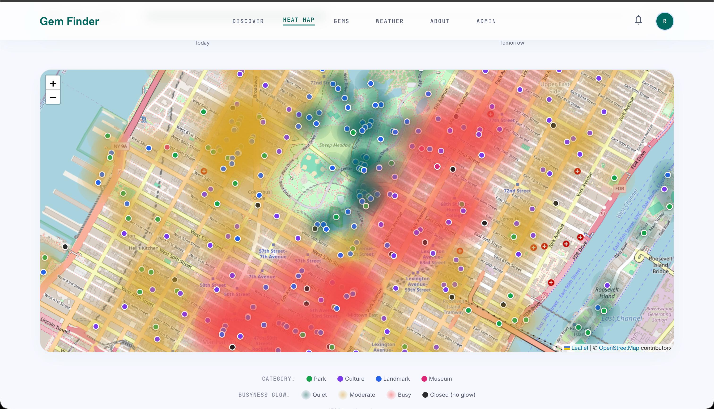
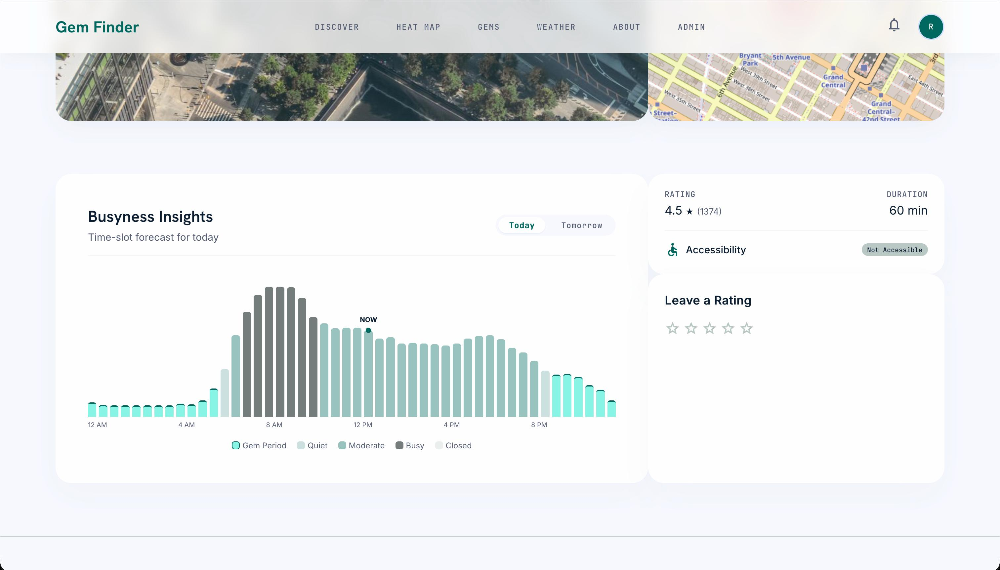
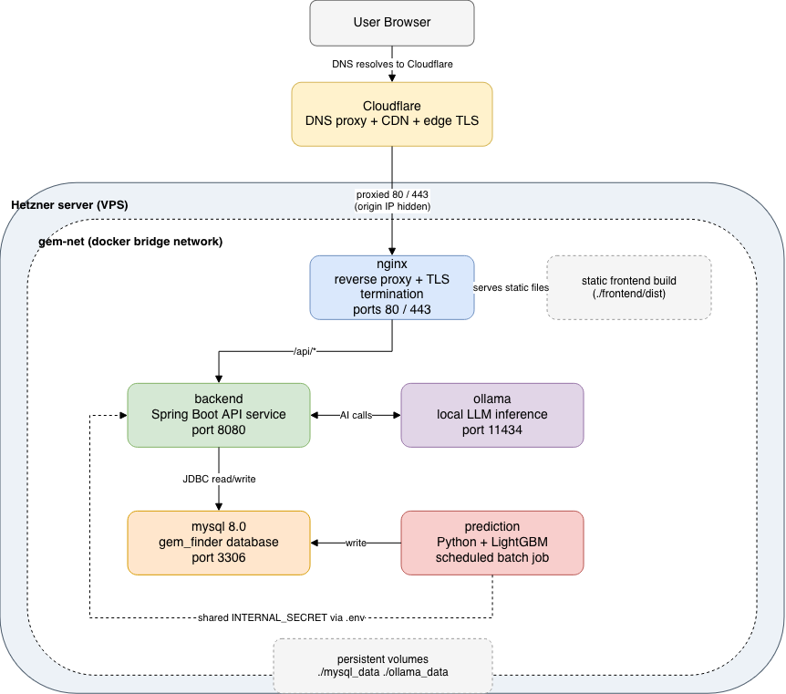

# COMP47360_Project_Gem Finder

Gem Finder is a full-stack application that helps people finding suitable low crowed time at a high rated attraction in Manhattan. It combines a Spring Boot backend, a React web app, a React Native mobile app, and a machine-learning model forecast attractions "busyness level" by a schedule python script.

## Features

The most important 3 features are: Gem Recommendation, Gem Period Bar Graph, Gem Heat Map, which helps the user get attraction busyness level insights from different angle, and  helps the user do the visiting decision making, which can let them have a more joyful visiting experience.





## Repository Structure

```
COMP47360/
├── Backend/               Spring Boot REST API (Java, Spring Boot, MySQL, JPA, JWT)
├── FrontendWeb/           React web frontend
├── FrontendMobile/        React Native (Expo) mobile frontend
├── ML/                    Jupyter notebook for training the busyness forecasting model
├── ModelServing/          Daily schedule script that calculate the trained model daily and populate the database
├── Data/                  Scripts to scrape POI data, populate POI data to database, and create accounts
├── deploy/                Docker Compose stack for production deployment
└── docs/                  Project documentations
```

## Deployment

A production-ready Docker Compose stack is provided in `deploy/deployCloud`. Before starting the stack, the backend jar, the built frontend, and the ML model artifacts need to be placed where the Compose build/mounts expect them:

### Model artifacts

`ModelServing/Predict.py` (run from `deploy/deployCloud/prediction/`) loads `combined_dropoffs.csv` from `deploy/deployCloud/prediction/ML/output/`, which is **not included in this repo** because it's too large. Download it from the Google Drive link noted in `deploy/deployCloud/prediction/ML/output/big_file_upload_to_google_drive.example`, and place it directly in `deploy/deployCloud/prediction/ML/output/` (alongside `lgb_model.txt` and `feature_cols.json`) before building/starting the `prediction` container.

### Build & place artifacts

**Backend** — Build the Spring Boot jar and copy it into `deploy/deployCloud/backend/`:

```bash
cd Backend/GemFinder
./mvnw clean package -DskipTests
cp target/GemFinder-*.jar ../../deploy/deployCloud/backend/
```

**Frontend** — Build the web app and copy its `dist/` output into `deploy/deployCloud/frontend/dist/`:

```bash
cd FrontendWeb
pnpm install && pnpm build   
cp -r dist ../deploy/deployCloud/frontend/
```

### Start the stack

```bash
cd deploy/deployCloud
docker compose up -d
```

This starts MySQL, Ollama, the Spring Boot backend, the prediction batch service, and Nginx (serving the built web frontend and terminating TLS with certificates placed in `nginx/ssl/`). Configure secrets (`MYSQL_ROOT_PASSWORD`, `JWT_SECRET`, `INTERNAL_SECRET`) via a `.env` file before starting.

### One-time data & account seeding

The `prediction` container's `Dockerfile` only auto-runs `script/Predict.py` on startup (the daily batch forecasting job). The other scripts in `deploy/deployCloud/prediction/script/` are **one-off setup scripts** that must be run manually, once, after the stack is up. Run them inside the running `prediction` container (its `config.py` is hardcoded to connect to the `db` service):

1. **`populate_poi_data.py`** — imports attraction/POI data from `output/attractions_final_v2.csv` into the `attractions` table. Run this first so there's data for recommendations and forecasting to work with.
2. **`create_real_accounts.py`** — creates real admin/superadmin/user accounts. Edit the `ACCOUNTS` list in the script with real usernames/emails/passwords before running, and clear the plaintext passwords from the file afterward.
3. **`create_placeholder_users.py`** *(optional)* — inserts 50 non-loginable placeholder users, useful for demos when there isn't real user data yet.

```bash
docker compose exec prediction python script/populate_poi_data.py
docker compose exec prediction python script/create_real_accounts.py
docker compose exec prediction python script/create_placeholder_users.py   # optional
```

1. **Re-run `Predict.py` once with `--now`.** The `prediction` container already runs `Predict.py` once automatically on startup, but it typically starts up (per `docker-compose.yml`'s `depends_on`) before you've had a chance to run `populate_poi_data.py`. That first automatic run will trigger gem/recommendation generation against an empty `attractions` table, producing empty results — and the next automatic run isn't until the next day's scheduled hour (03:00 by default). After seeding the attraction data, manually re-run it once so busyness forecasts and recommendations are populated immediately:

```bash
docker compose exec prediction python script/Predict.py --now
```

### Pull the Ollama model

The weather chatbot needs the `gemma2:2b` model available inside the `ollama` container. Pull it once after the stack is up:

```bash
docker compose exec ollama ollama pull gemma2:2b
```



## Mobile Frontend

Standalone build on a physical iOS device

To install a build that runs independently of the dev machine — build a **Release** configuration and install it straight onto a USB-connected iPhone:

```bash
cd FrontendMobile
npm install
bundle exec npx expo run:ios --device --configuration Release
```

Prerequisites: Xcode installed and signed in with an Apple ID (`Xcode → Settings → Accounts`), with a development certificate generated at least once (`Manage Certificates` → **+** → **Apple Development**); the iPhone connected via USB with Developer Mode enabled (`Settings → Privacy & Security → Developer Mode`). If the first run fails with `No code signing certificates are available to use`, generate the certificate in Xcode, then toggle **Automatically manage signing** off/on again under the target's **Signing & Capabilities** tab in `ios/*.xcworkspace`. On first launch, if iOS shows "Untrusted Developer", go to `Settings → General → VPN & Device Management` and trust the Apple ID used to sign the build.

**Free Apple ID builds expire after 7 days.** Without a paid Apple Developer Program membership ($99/year), apps signed with a personal/free Apple ID stop launching exactly 7×24 hours after install (regardless of usage) and must be reinstalled by re-running the command above. A paid membership removes this limit and also enables cloud builds via `eas build --profile preview --platform ios` that don't require a local Xcode/USB connection.
